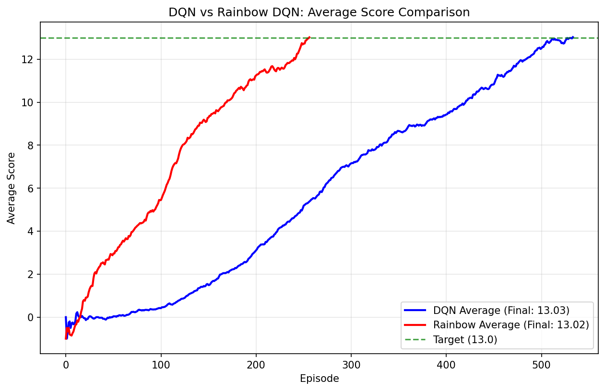

# Navigation DQN Project Report

## Project Overview

This project implements and compares two Deep Q-Network (DQN) approaches for training an agent to navigate and collect bananas in a Unity ML-Agents environment. The agent learns to maximize rewards by collecting yellow bananas (+1 reward) while avoiding blue bananas (-1 reward) in a large, square world.

**Environment Details:**
- **State Space**: 37-dimensional continuous vector (agent velocity + ray-based perception)
- **Action Space**: 4 discrete actions (move forward, backward, turn left, turn right)
- **Goal**: Achieve an average score of +13 over 100 consecutive episodes

## Learning Algorithms

### 1. Standard DQN Agent

The standard DQN implementation follows the original Deep Q-Learning algorithm with the following key components:

**Core Algorithm Features:**
- **Experience Replay**: Stores transitions in a replay buffer to break correlation between consecutive samples
- **Target Network**: Uses a separate target network for stable Q-value computation
- **Epsilon-Greedy Exploration**: Gradually reduces exploration from ε=1.0 to ε=0.01

**Hyperparameters:**
```python
BUFFER_SIZE = 100,000    # replay buffer size
BATCH_SIZE = 64          # minibatch size
GAMMA = 0.99             # discount factor
TAU = 1e-3               # soft update parameter for target network
LR = 5e-4                # learning rate
UPDATE_EVERY = 4         # network update frequency
eps_start = 1.0          # initial epsilon value
eps_end = 0.01           # minimum epsilon value
eps_decay = 0.995        # epsilon decay rate per episode
```

**Neural Network Architecture:**
- **Input Layer**: 37 neurons (state size)
- **Hidden Layer 1**: 128 neurons with ReLU activation
- **Hidden Layer 2**: 128 neurons with ReLU activation
- **Output Layer**: 4 neurons (action size) - Q-values for each action

### 2. Rainbow DQN Agent

> **AI Assistance Disclaimer**: The Rainbow DQN implementation in this project was developed with assistance from AI tools. The Standard DQN implementation and all analysis, training, and documentation were completed independently.

The Rainbow DQN implements **all 6 extensions** from the original Rainbow paper, combining multiple advanced techniques into a single algorithm:

**Complete Rainbow Extensions:**
1. **Double DQN**: Uses online network for action selection and target network for evaluation to reduce overestimation bias
2. **Prioritized Experience Replay**: Samples important transitions more frequently using TD-error based priorities with importance sampling
3. **Dueling DQN Architecture**: Separates value and advantage streams for better learning of state values
4. **Multi-step Learning**: Uses n-step returns (n=3) for better temporal credit assignment
5. **Distributional DQN (C51)**: Models full distribution of returns with 51 atoms instead of just expected values
6. **Noisy Networks**: Replaces epsilon-greedy with learnable noise parameters for exploration

**Hyperparameters:**
```python
BUFFER_SIZE = 100,000    # replay buffer size
BATCH_SIZE = 64          # minibatch size
GAMMA = 0.99             # discount factor
LR = 5e-4                # learning rate
UPDATE_EVERY = 4         # network update frequency
n_steps = 3              # multi-step learning steps
atom_size = 51           # number of atoms for distributional DQN
v_min = -10              # minimum value for value distribution
v_max = 10               # maximum value for value distribution
```

**Neural Network Architecture:**
- **Input Layer**: 37 neurons (state size)
- **Shared Layers**: 128 → 128 neurons with ReLU activation
- **Value Stream**: 128 → 51 atoms (distributional values)
- **Advantage Stream**: 128 → 4×51 atoms (distributional advantages per action)
- **Noisy Layers**: Learnable noise parameters for exploration

## Results and Performance

### Training Performance

Both agents successfully solved the environment, achieving the target average score of +13 over 100 consecutive episodes:

|  | Standard DQN | Rainbow DQN |
|--------|-------------|-------------|
| Episodes to solve | 493 | 244 |
| Training time per episode | 1x | 3x |

### Plot of Rewards

#### Standard DQN Training Progress


The DQN agent successfully learned to solve the environment, showing the raw episode scores (light blue) and the moving average (dark blue line). **The DQN agent achieves an average score of +13 after 493 episodes** .

#### Rainbow DQN Training Progress


The Rainbow DQN agent demonstrates faster learning, with the moving average reaching the target score in fewer episodes. **The Rainbow DQN achieves an average score of +13 after 244 episodes** .

#### Agent Comparison


Direct comparison of both agents' moving averages shows that both successfully solve the environment, with Rainbow DQN achieving faster convergence.

## Implementation Details

### Code Structure
```
navigation_dqn/
├── main.py                           # Training script with comparison
├── dqn_agent/
│   ├── agent.py                     # Standard DQN implementation
│   └── model.py                     # Simple feedforward network
├── rainbow_dqn_agent/
│   ├── agent.py                     # Rainbow DQN implementation
│   ├── model.py                     # Dueling network architecture
│   ├── prioritized_replay_buffer.py # Prioritized experience replay
│   └── multi_step_buffer.py         # Multi-step learning buffer
├── *.png                            # Training result plots
└── *.pth                            # Saved model weights
```

## Ideas for Future Work

- **Deeper Networks**: Add more hidden layers with batch normalization
- **Hyperparameter Tuning**: Use automated optimization tools
- **Transfer Learning**: Test on different navigation environments
- **Ablation Studies**: Analyze individual component contributions of the Rainbow DQN